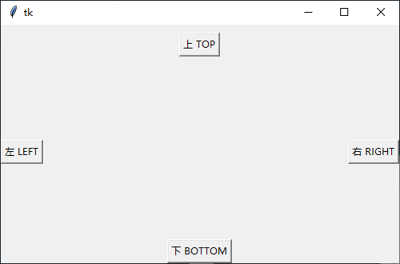

# Tkinter


## tkinter 介绍

官方用的GUI工具包 —— tkinter（IDLE就是用这个开发的）。

tkinter 是 Python 的标准 GUI 库，它实际是建立在 Tk 技术上的。在大多数 Unix 平台以及 Windows 系统上都可用。

作为 python 特定的 GUI 界面，是一个图像的窗口，tkinter 是 python 自带的，可以编辑的GUI界面，我们可以用GUI 实现很多直观的功能，比如想开发一个计算器，如果只是一个键盘输入，输出的黑色窗口，是没用用户体验的。所有开发一个图像化的小窗口，就是必要的。

对于稍有 GUI 编程经验的人来说，Python 的 Tkinter 界面库是非常简单的。python 的 GUI 库非常多，选择Tkinter，一是最为简单，二是自带库，不需下载安装，随时使用，三则是从需求出发，Python 作为一种脚本语言，或者说一种胶水语言，一般不会用它来开发复杂的桌面应用，它并不具备这方面的优势，使用 Python，可以把它作为一个灵活的工具，而不是作为主要开发语言，那么在工作中，需要制作一个小工具，肯定是需要有界面的，不仅自己用，也能分享别人使用，在这种需求下，Tkinter 是足够胜任的！


tkinter 是 Python 默认的 GUI 库，像 IDLE 就是用 tkinter 设计出来的，因此直接导入 tkinter 模块就可以了：


```
import tkinter
```

### tkinter 之初体验

接下来从最简单的例子入手：

python

```python
import tkinter as tk

# 创建一个主窗口,用于容纳整个GUI程序
root = tk.Tk()

# 设置主窗口对象的标题栏
root.title("First Demo")

# 设置窗口大小
root.geometry('500x300+100+100')

# 添加一个Label组件,Label组件是GUI程序中最常用的组件之一。
# Label组件可以显示文本、图标或者图片
# 在这里我们让它显示指定文本
label = tk.Label(root, text="我的第一个tkinter窗口!")

# 然后调用Label组件的pack()方法,用于自动调节组件自身的尺寸
label.pack()

# 注意,这时候窗口还是不会显示的…
# 除非执行下面这条代码!
root.mainloop()
```

执行程序，如图所示。


loop 因为是循环的意思，root.mainloop 就会让 root 不断的刷新，如果没有 mainloop ,就是一个静态的 root ,传入进去的值就不会有循环，mainloop 就相当于一个很大的 while 循环，有个 while ，每点击一次就会更新一次，所以我们必须要有循环。 所有的窗口文件都必须有类似的 mainloop 函数，mainloop 是窗口文件的关键的关键。

意思是一旦进入了主事件循环，就由 Tkinter 掌管一切了。现在不理解没关系，在后面的学习中你会有深刻的体会。GUI 程序的开发与以往的开发经验会有截然不同的感受。

### 封装代码

通常如果要写一个比较大的程序，那么应该先把代码给封装起来。在面向对象的编程语言中，就是封装成类。看下面进阶版的例子：

python

```python
import tkinter as tk


def create_button(root):
    label = tk.Label(root, text="我的第一个tkinter窗口!")
    label.pack()
    return root


root = tk.Tk()
root.geometry('500x300+100+100')
root = create_button(root)

root.mainloop()
```

程序跑起来后出现一个“打招呼”按钮，单击它就能从IDLE接收到回馈信息，如图15-3所示。


## 窗口的管理与设置

不知道大家是否注意到了，上述举例的简单demo程序存在窗口显示混乱的情况，这样的一个界面显然是不符合我们要求的。所以我们首先要开始学习如何使用tkinter去控制我们的窗口

### 基本属性设置

#### 添加标题

python

```python
# 设置窗口标题
root.title("title")
```

#### 添加图标

python

```python
#  设置图标，以OneDrive图标为例，必须是以 .ico 为后缀的图标文件，放于同目录下。
root.iconbitmap("OneDrive.ico")
```

#### 设置背景

python

```python
#  设置背景色，可以用英文名，也可以用十六进制表示的颜色。
root["background"] = "#00ffff"
```

完整代码

python

```python
#  导入模块，取别名
import tkinter as tk

#  实例化一个窗体对象
root = tk.Tk()
#  设置窗口的大小长宽为300x300出现的位置距离窗口左上角+150+150
root.geometry("300x300+150+150")
#  设置窗口标题
root.title("title")
#  设置图标，以OneDrive图标为例，必须是以 .ico 格式的图标文件，放于同目录下。
root.iconbitmap("OneDrive.ico")
#  设置背景色，可以用英文名，也可以用十六进制表示的颜色。
root["background"] = "#00ffff"
#  进入消息循环，显示窗口
root.mainloop()
```

效果演示


### 外形设置

#### 1.设置透明度

python

```python
#  透明度的值:0~1 也可以是小数点，0：全透明；1：全不透明
root.attributes("-alpha", 0.6)
```

#### 2.设置工具栏样式

python

```python
#  True 只有退出按钮，也没有图标；False 正常的窗体样式
root.attributes("-toolwindow", True)
```

效果演示


#### 3.设置全屏

python

```python
#  True 全屏；False 正常显示
root.attributes("-fullscreen", True)
```

#### 4.窗口置顶

python

```python
#  True 所有窗口中处于最顶层；False 正常显示 两个同时被置顶的窗口为同级(能互相遮盖)，但他们都能同时遮盖住没有被设置为置顶的窗口。
root.attributes("-topmost", True)
```

#### 5.设置成脱离工具栏

python

```python
#  True 没有工具栏按钮；False 正常显示
root.overrideredirect(True)
```

完整代码

python

```python
#  导入模块，取别名
import tkinter as tk

#  实例化一个窗体对象
root = tk.Tk()
#  设置窗口的大小长宽为300x300出现的位置距离窗口左上角+150+150
root.geometry("300x300+150+150")
#  设置窗口标题
root.title("title")
#  设置图标，以OneDrive图标为例，必须是以 .ico 为后缀的图标文件，放于同目录下。
root.iconbitmap("OneDrive.ico")
#  设置背景色，可以用英文名，也可以用十六进制表示的颜色。
root["background"] = "#00ffff"
#  True 全屏；False 正常显示
root.attributes("-fullscreen", True)
#  True 所有窗口中处于最顶层；False 正常显示 两个同时被置顶的窗口为同级(能互相遮盖)，但他们都能同时遮盖住没有被设置为置顶的窗口。
root.attributes("-topmost", True)
#  True 没有工具栏按钮；False 正常显示
root.overrideredirect(True)
#  进入消息循环，显示窗口
root.mainloop()
```

### 窗体的方法

#### 1.获取屏幕大小

python

```python
screenheight = root.winfo_screenheight()
screenwidth = root.winfo_screenwidth()
```

完整代码

python

```python
#  导入模块，取别名
import tkinter as tk

#  实例化一个窗体对象
root = tk.Tk()
#  获取屏幕大小
screenheight = root.winfo_screenheight()
screenwidth = root.winfo_screenwidth()
print("屏幕高度：", screenheight)
print("屏幕宽度：", screenwidth)
rootwidth = 300
roothight = 300
#  设置窗口在屏幕居中
root.geometry("%dx%d+%d+%d" % (rootwidth, roothight, (screenwidth - rootwidth) / 2, (screenheight - roothight) / 2))
#  进入消息循环，显示窗口
root.mainloop()
```

演示效果


#### 2.获取窗体位置

python

```python
root_x = root.winfo_x()
root_y = root.winfo_y()
```

#### 3.获取窗体大小

python

```python
root_height = root.winfo_height()
root_width = root.winfo_width()
```

完整代码

python

```python
#  导入模块，取别名
import tkinter as tk

#  实例化一个窗体对象
root = tk.Tk()
#  设置窗体高宽和位置
root.geometry("600x500+150+150")
#  更新窗体
root.update()
#  获取窗体位置
root_x = root.winfo_x()
root_y = root.winfo_y()
#  获取窗体大小
root_height = root.winfo_height()
root_width = root.winfo_width()
#  输出窗体位置和窗体高宽
print(root_x)
print(root_y)
print(root_width)
print(root_y)
#  进入消息循环，显示窗口
root.mainloop()
```

演示效果


## 布局管理器

所有的Tkinter组件都包含专用的几何管理方法，这些方法是用来组织和管理整个父配件区中子配件的布局的。Tkinter提供了截然不同的三种几何管理类：pack、grid和place。

**pack：** 是按添加顺序排列组件。

**grid：** 是按行／列形式排列组件。

**place：** 允许程序员指定组件的大小和位置。

#### 顺序布局（pack）

pack 几何管理采用块的方式组织配件，在快速生成界面设计中广泛采用，若干组件简单的布局，采用 pack 的代码量最少。pack 几何管理程序根据组件创建生成的顺序将组件添加到父组件中去。通过设置相同的锚点（anchor）可以将一组配件紧挨一个地方放置，如果不指定任何选项，默认在父窗体中自顶向下添加组件。

pack 方法提供了下列 option 选项，选项可以直接赋值或以字典变量加以修改：

| 名称         | 描述                                                         | 取值范围                                                     |
| :----------- | :----------------------------------------------------------- | :----------------------------------------------------------- |
| expand       | 当值为 `"yes"` 时，`side` 选项无效。组件显示在父配件中心位置；若 `fill` 选项为 `"both"`,则填充父组件的剩余空间。 | `"yes"`, 自然数, `"no"`, `0` （默认值为 `"no"` 或 `0`）      |
| fill         | 填充 `x(y)` 方向上的空间，当属性 `side="top"` 或 `"bottom"` 时，填充 `x` 方向；当属性 `side="left"` 或 `"right"` 时，填充 `"y"` 方向；当 `expand` 选项为`"yes"`时，填充父组件的剩余空间。 | `"x"`, `"y"`, `"both"`(默认值为待选)                         |
| ipadx, ipady | 组件内部在 `x(y)` 方向上填充的空间大小，默认单位为像素，可选单位为c（厘米）、m（毫米）、i（英寸）、p（打印机的点，即1/27英寸），用法为在值后加以上一个后缀既可。 | 非负浮点数（默认值为0.0）                                    |
| padx, pady   | 组件外部在 `x(y)` 方向上填充的空间大小，默认单位为像素，可选单位为c（厘米）、m（毫米）、i（英寸）、p（打印机的点，即1/27英寸），用法为在值后加以上一个后缀既可。 | 非负浮点数（默认值为0.0）                                    |
| side         | 定义停靠在父组件的哪一边上。                                 | "top", "bottom", "left", "right"（默认为"top"）              |
| before       | 将本组件于所选组建对象之前 `pack`，类似于先创建本组件再创建选定组件。 | 已经 pack 后的组件对象                                       |
| after        | 将本组件于所选组建对象之后 `pack`，类似于先创建选定组件再本组件。 | 已经 pack 后的组件对象                                       |
| in_          | 将本组件作为所选组建对象的子组件，类似于指定本组件的 `master` 为选定组件。 | 已经 pack 后的组件对象                                       |
| anchor       | 对齐方式，左对齐`"w"`，右对齐`"e"`，顶对齐`"n"`，底对齐`"s"` | "n", "s", "w", "e", "nw", "sw", "se", "ne", "center" (默认为"center") |

**注：** 以上选项中可以看出 `expand`、`fill` 和 `side` 是相互影响的。

Tkinter 模块提供了一系列大写值，其等价于字符型小写值，即 `Tkinter.YES == "yes"`。

#### 设置控件方位

可以通过修改 pack() 方法的 side 参数，side 参数可以设置 LEFT、RIGHT、TOP 和 TOTTOM 四个方位，默认的设置是 side=tkinter.TOP。

例如可以修改为左对齐

python

```python
say_hello.pack(side=tk.LEFT)
```

如果你不想按钮挨着"墙角"，可以通过设置 pack() 方法的 padx 和 pady 参数自定义按钮的偏移位置：

python

```python
say_hello.pack(side=tk.LEFT, padx=10, pady=10)
```

按钮既然可以设置前景色，那一定也能设置背景色吧？没错，bg 参数就是 background 背景色的缩写：

python

```python
say_hello = tk.Button(frame, text='打招呼', bg="black", fg='blue')
```



#### 多组件依次排列

**多组件布局（从左往右）**：默认布局是从上往下。

我们常常会遇到的一个情况是将一个组件放到一个容器组件中，并填充整个父组件。下面生成一个Listbox组件并将它填充到root窗口中：

python

```python
import tkinter as tk

root = tk.Tk()
root.geometry("500x300+100+100")

# 多组件依次排列
tk.Label(root, text="Red", bg="red", fg="white").pack()
tk.Label(root, text="Green", bg="green", fg="black").pack()
tk.Label(root, text="Blue", bg="blue", fg="white").pack()

tk.mainloop()
```


#### fill 填充内容

fill 选项是告诉窗口管理器该组件将填充整个分配给它的空间，BOTH 表示同时横向和纵向扩展，X 表示横向，Y 表示纵向；expand 选项是告诉窗口管理器将父组件的额外空间也填满。

默认情况下，pack 是将添加的组件依次纵向排列：

python

```python
# fill 组件里面的内容进行填充
tk.Label(root, text="Red", bg="red", fg="white").pack(anchor=tk.W, fill=tk.X)
tk.Label(root, text="Green", bg="green", fg="black").pack(anchor=tk.W, fill=tk.X)
tk.Label(root, text="Blue", bg="blue", fg="white").pack(anchor=tk.W, fill=tk.X)
```


#### 横向排列

如果想要组件横向挨个儿排列，可以使用side选项：

python

```python
# side 组件与组件之间的对齐方式 会影响后续的布局内容
tk.Label(root, text="Red", bg="red", fg="white").pack(side=tk.LEFT)
tk.Label(root, text="Green", bg="green", fg="black").pack(side=tk.LEFT)
tk.Label(root, text="Blue", bg="blue", fg="white").pack(side=tk.LEFT)
```


### pack 布局方法

**pack类提供了下列函数：**

| 函数名             | 描述                                                         |
| :----------------- | :----------------------------------------------------------- |
| slaves()           | 以列表方式返回本组件的所有子组件对象。                       |
| propagate(boolean) | 设置为 True 表示父组件的几何大小由子组件决定（默认值），反之则无关。 |
| info()             | 返回 pack 提供的选项所对应得值。                             |
| forget()           | Unpack 组件，将组件隐藏并且忽略原有设置，对象依旧存在，可以用 pack(option, …)，将其显示。 |
| location(x, y)     | x, y 为以像素为单位的点，函数返回此点是否在单元格中，在哪个单元格中。返回单元格行列坐标，(-1, -1)表示不在其中。 |
| size()             | 返回组件所包含的单元格，揭示组件大小。                       |

### 表格布局（grid）

grid 几何管理采用类似表格的结构组织配件，使用起来非常灵活，用其设计对话框和带有滚动条的窗体效果最好。grid 采用行列确定位置，行列交汇处为一个单元格。每一列中，列宽由这一列中最宽的单元格确定。每一行中，行高由这一行中最高的单元格决定。组件并不是充满整个单 元格的，你可以指定单元格中剩余空间的使用。你可以空出这些空间，也可以在水平或竖直或两个方向上填满这些空间。你可以连接若干个单元格为一个更大空间， 这一操作被称作跨越。创建的单元格必须相临。

**grid**方法提供了下列 option 选项，选项可以直接赋值或以字典变量加以修改：

| 名称         | 描述                                                         | 取值范围                                                     |
| :----------- | :----------------------------------------------------------- | :----------------------------------------------------------- |
| column       | 组件所置单元格的列号。                                       | 自然数（起始默认值为0，而后累加）                            |
| columnspan   | 从组件所置单元格算起在列方向上的跨度。                       | 自然数（起始默认值为0）                                      |
| ipadx, ipady | 组件内部在x(y)方向上填充的空间大小，默认单位为像素，可选单位为c（厘米）、m（毫米）、i（英寸）、p（打印机的点，即1/27英寸），用法为在值后加以上一个后缀既可。 | 非负浮点数（默认值为0.0）                                    |
| padx, pady   | 组件外部在x(y)方向上填充的空间大小，默认单位为像素，可选单位为c（厘米）、m（毫米）、i（英寸）、p（打印机的点，即1/27英寸），用法为在值后加以上一个后缀既可。 | 非负浮点数（默认值为0.0）                                    |
| row          | 组件所置单元格的行号。                                       | 自然数（起始默认值为0，而后累加）                            |
| rowspan      | 从组件所置单元格算起在行方向上的跨度。                       | 自然数（起始默认值为0）                                      |
| in_          | 将本组件作为所选组建对象的子组件，类似于指定本组件的master为选定组件。 | 已经pack后的组件对象                                         |
| sticky       | 组件紧靠所在单元格的某一边角。                               | "n", "s", "w", "e", "nw", "sw", "se", "ne", "center"(默认为" center") |

使用 grid 排列组件，只需告诉它你想要将组件放置的位置（行／列，row选项指定行，cloumn 选项指定列）。此外，你并不用提前指出网格（grid 分布给组件的位置称为网格）的尺寸，因为管理器会自动计算。

python

```python
import tkinter as tk

root = tk.Tk()
root.geometry("500x300+100+100")

# column默认值是0
tk.Entry(root).grid(row=1, column=1)
tk.Entry(root).grid(row=1, column=2)
tk.Entry(root).grid(row=1, column=3)
tk.Entry(root).grid(row=2, column=1)
tk.Entry(root).grid(row=2, column=2)
tk.Entry(root).grid(row=2, column=3)

tk.mainloop()
```

登录表单

python

```python
import tkinter as tk

root = tk.Tk()
root.geometry("500x300+100+100")

# sticky 指定内容排列的方位
tk.Label(root, text="用户名").grid(row=1, column=1)
tk.Entry(root).grid(row=1, column=2)

tk.Label(root, text="密码").grid(row=2, column=1)
tk.Entry(root, show="*").grid(row=2, column=2)

tk.Button(root, text='提交').grid(row=3, column=2)

tk.mainloop()
```


### 组件内容的对其方式

默认情况下组件会居中显示在对应的网格里，你可以使用sticky选项来修改这一特性。该选项可以使用的值有 E、W、S、N（EWSN分别表示东西南北，即上北下南左西右东）以及它们的组合。因此，可以通过sticky=W使得Label左对齐：

python

```python
"""设置表格布局组件内的布局方位 """
tk.Label(root, text="用户名", padx=10).grid(row=1, column=1, sticky=tk.E)
tk.Entry(root).grid(row=1, column=2)

tk.Label(root, text="密码", padx=10).grid(row=2, column=1, sticky=tk.E)
tk.Entry(root, show="*").grid(row=2, column=2)

tk.Button(root, text='提交').grid(row=3, column=2)
```


有时候可能需要用几个网格来放置一个组件，可以做到吗？当然可以，只需要指定rowspan和columnspan就可以实现跨行和跨列的功能：

### 跨行和跨列布局

python

```python
import tkinter as tk

root = tk.Tk()

root.geometry("500x300+100+100")

# column默认值是0
tk.Label(root, text="用户名").grid(row=1, column=1, sticky=tk.E)
tk.Entry(root).grid(row=1, column=2)

tk.Label(root, text="密码").grid(row=2, column=1, sticky=tk.E)
tk.Entry(root, show="*").grid(row=2, column=2)

# 实现跨行需求
tk.Button(text="提交", width=20).grid(row=3, column=1, columnspan=2)
tk.mainloop()
```


### grid 布局方法

| 函数名             | 描述                                                         |
| :----------------- | :----------------------------------------------------------- |
| slaves()           | 以列表方式返回本组件的所有子组件对象。                       |
| propagate(boolean) | 设置为True表示父组件的几何大小由子组件决定（默认值），反之则无关。 |
| info()             | 返回pack提供的选项所对应得值。                               |
| forget()           | Unpack组件，将组件隐藏并且忽略原有设置，对象依旧存在，可以用pack(option, …)，将其显示。 |
| grid_remove ()     |                                                              |

## 绝对布局（place）

通常情况下不建议使用place布局管理器，因为对比起pack和grid，place要做更多的工作。不过纯在即合理，place在一些特殊的情况下可以发挥妙用。请看下面的例子。

使用place，可以将子组件显示在父组件的正中间：

python

```python
import tkinter as tk

root = tk.Tk()
root.geometry("500x300+100+100")

# relx 和 rely 选项指定的是相对于父组件的位置
# 范围是 00～1.0，因此 0.5 表示位于正中间。
tk.Button(root, text="绝对布局-正中心").place(relx=0.5, rely=0.5, anchor=tk.CENTER)

tk.mainloop()
```


在某种情况下，或许你希望一个组件可以覆盖另一个组件，那么place又可以派上用场了。下面例子演示用Button覆盖Label组件：

python

```python
import tkinter as tk

root = tk.Tk()
root.geometry("500x300+100+100")

photo = tk.PhotoImage(file="../../assets/logo.png")
tk.Label(root, image=photo).pack()

# 绝对布局的组件可以在其他组件之上
tk.Label(root, text="覆盖组件").place(relx=0.5, rely=0.2, anchor=tk.CENTER)

tk.mainloop()
```


利用 place 覆盖组件

不难看出，relx和rely选项指定的是相对于父组件的位置，范围是00～1.0，因此0.5表示位于正中间。那么relwidth和relheight选项则是指定相对于父组件的尺寸：


相对位置和相对尺寸

python

```python
import tkinter as tk

root = tk.Tk()
root.geometry("500x300+100+100")
tk.Label(root, bg="red").place(relx=0.5,
                               rely=0.5,
                               relheight=0.75,
                               relwidth=0.75,
                               anchor=tk.CENTER)
tk.Label(root, bg="yellow").place(relx=0.5,
                                  rely=0.5,
                                  relheight=0.5,
                                  relwidth=0.5,
                                  anchor=tk.CENTER)
tk.Label(root, bg="green").place(relx=0.5,
                                 rely=0.5,
                                 relheight=0.25,
                                 relwidth=0.25,
                                 anchor=tk.CENTER)

tk.mainloop()
```

对于上面的代码，无论你如何拉伸改变窗口，三个 Label 的尺寸均会跟着同步。


## 布局组件

### Frame 组件Frame（框架）组件是在屏幕上的一个矩形区域。Frame 主要是作为其他组件的框架基础，或为其他组件提供间距填充。

Frame 组件主要用于在复杂的布局中将其他组件分组，也用于填充间距和作为实现高级组件的基类。

| 选项                | 含义                                                         |
| :------------------ | :----------------------------------------------------------- |
| background          | 1. 设置 Frame 组件的背景颜色 2. 默认值由系统指定 3. 为了防止更新，可以将颜色值设置为空字符串 |
| bg                  | 跟 background 一样                                           |
| borderwidth         | 1. 指定 Frame 的边框宽度 2. 默认值是 0                       |
| bd                  | 跟 borderwidth 一样                                          |
| class_              | 默认值是 Frame                                               |
| colormap            | 1. 有些显示器只支持 256 色（有些可能更少），这种显示器通常提供一个颜色映射来指定要使用要使用的 256 种颜色 2. 该选项允许你指定用于该组件以及其子组件的颜色映射 3. 默认情况下，Frame 使用与其父组件相同的颜色映射 4. 使用此选项，你可以使用其他窗口的颜色映射代替（两窗口必须位于同个屏幕并且具有相同的视觉特性） 5. 你也可以直接使用 "new" 为 Frame 组件分配一个新的颜色映射 6. 一旦创建 Frame 组件实例，你就无法修改这个选项的值 |
| container           | 1. 该选项如果为 True，意味着该窗口将被用作容器，一些其它应用程序将被嵌入 2. 默认值是 False |
| cursor              | 1. 指定当鼠标在 Frame 上飘过的时候的鼠标样式 2. 默认值由系统指定 |
| height              | 1. 设置 Frame 的高度 2. 默认值是 0                           |
| highlightbackground | 1. 指定当 Frame 获得焦点的时候高亮边框的颜色 2. 默认值由系统指定 |
| highlightthickness  | 1. 指定高亮边框的宽度 2. 默认值是 0（不带高亮边框）          |
| padx                | 水平方向上的边距                                             |
| pady                | 垂直方向上的边距                                             |
| relief              | 1. 指定边框样式 2. 默认值是 "flat" 3. 另外你还可以设置 "sunken"，"raised"，"groove" 或 "ridge" 4. 注意，如果你要设置边框样式，记得设置 borderwidth 或 bd 选项不为 0，才能看到边框 |
| takefocus           | 1. 指定该组件是否接受输入焦点（用户可以通过 tab 键将焦点转移上来） 2. 默认值是 False |
| visual              | 1. 为新窗口指定视觉信息 2. 该选项没有默认值                  |
| width               | 1. 设置 Frame 的宽度 2. 默认值是 0                           |

### 案例

python

```python
import tkinter as tk

root = tk.Tk()
root.geometry("500x300+100+100")

left_frame = tk.Frame(root, width=250)
left_frame.pack(side=tk.LEFT)

tk.Label(left_frame, bg='red', width=10, height=2).pack(fill=tk.X)
tk.Label(left_frame, bg='blue', width=10, height=2).pack(fill=tk.X)
tk.Label(left_frame, bg='yellow', width=10, height=2).pack(fill=tk.X)

right_frame = tk.Frame(root)
right_frame.pack(side=tk.RIGHT)
tk.Label(right_frame, bg='red', width=2, height=10).pack(side=tk.LEFT)
tk.Label(right_frame, bg='blue', width=2, height=10).pack(side=tk.LEFT)
tk.Label(right_frame, bg='yellow', width=2, height=10).pack(side=tk.LEFT)

root.mainloop()
```


## LabelFrame 组件

LabelFrame 组件是 Frame 框架的进化版，从形态上来说，也就是添加了 Label 的 Frame ，但有了它，Checkbutton 和 Radiobutton 的组件分组就变得简单了：

python

```python
import tkinter as tk

root = tk.Tk()
root.geometry("500x300+100+100")
group = tk.LabelFrame(root, text='最好的脚本语言是?', padx=5, pady=5)
group.pack(side=tk.LEFT, padx=10, pady=10)

langs = [
    ('python', 1),
    ('perl', 2),
    ('ruby', 3),
    ('lua', 4),
]

v = tk.IntVar()
v.set(1)

for lang, no in langs:
    b = tk.Radiobutton(group, text=lang, variable=v, value=no)
    b.pack(anchor=tk.W)

info_frame = tk.Frame(root)
info_frame.pack(side=tk.RIGHT)

tk.Label(info_frame, text="数据日志").pack()
text_area = tk.Text(info_frame, height=20, width=100)
text_area.pack(side=tk.LEFT)

root.mainloop()
```

