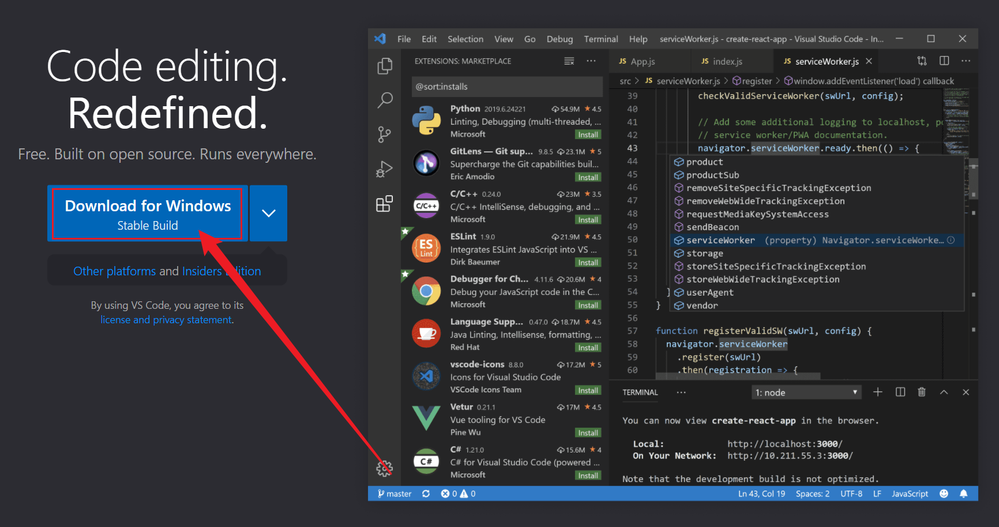

# VScode中配置 C/C++ 环境

|             Tip：请在电脑端查看             |
| :-----------------------------------------: |
| **@小纯Res@VScode配置C语言教程 2023.10.20** |

## 1. 下载编辑器VScode

- 官网：[https://code.visualstudio.com/](https://code.visualstudio.com/)（点链接时按下Ctrl，不会覆盖当前页面哦^-^）

  

   

- ###### 安装VScode（建议附加任务全部勾选）

  

 

 

## 2. 下载编译器MinGW并解压

###### 官网页面：https://www.mingw-w64.org/

###### 下载页面：https://sourceforge.net/projects/mingw-w64/files/

> 你可以进入官网自行寻找
>
> 你也可以直接点击为你找好的下载页面

###### 下载页面中选择 `x86_64-win32-seh` 下载


> 如果你因为网络环境限制无法下载
>
> 不限速下载，请笑纳^-^：[点击下载](https://pan.baidu.com/s/1BX8G0frUGLkMd5lL5_H_cg?qwe=0326) 密码:0326

- 在C盘中解压文件

  

  > 理论上你可以在任何地方解压，但注意路径不能包含中文，至于特殊字符请自行测试

 

 

## 3. 将MinGW添加至环境变量

- ###### 进入mingw64下的bin文件夹，复制当前路径，Win + i唤起系统设置，输入高级系统设置并进入，点击环境变量，选择path，编辑，新建，粘贴路径，按下三个确定

  

 

 

## 4. 配置VScode插件

- ###### 打开VScode安装插件 `Chinese` 和 `C/C++` ，等待安装完毕后重启VScode


> [点击下载插件文件](https://pan.baidu.com/s/1BX8G0frUGLkMd5lL5_H_cg?qwe=0326)

- ### 安装VSIX离线插件


## 5. 运行代码

- ###### 新建文件夹，修改为英文名称并进入，右键 `通过Code打开` 若在安装时未勾选相关选项，可能没有这个选项，请自行在VScode内操作打开文件夹

- ###### 新建一个文件，英文命名且扩展名为 `.c` 

- ###### 编写相关代码

  ```c#
  #include <stdio.h>
  #include <stdlib.h>
  int main()
  {
      printf("Hello World!\n");
      printf("你好世界！\n");
      system("pause"); // 防止运行后自动退出，需头文件stdlib.h
      return 0;
  }
  ```

  

- ###### VScode菜单栏，点击运行，启动调试，稍等程序运行，输出结果在下方终端，上方调试面板，点击最右边的 `橙色方框` 停止程序运行


 


## 6. 调整和优化

> 请根据自己的需要进行优化
>
> 代码运行后 `.vscode` 文件夹会自动生成在你的源文件目录下
>
> `.vscode`文件夹下的 `task.json` 用来控制程序的运行和调试

###### 解决中文乱码问题【推荐】

- ###### 打开`.vscode` 文件夹下的 `task.json` 文件，找到 `"${fileDirname}\\${fileBasenameNoExtension}.exe"` 在后面加上英文 `逗号` 然后回车到下一行，粘贴下面文本 `"-fexec-charset=GBK"` 并保存

  

   

收纳生成的 `exe` 可执行文件【可选】

- 打开`.vscode` 文件夹下的 `task.json` 文件，找到 `"${fileDirname}\\${fileBasenameNoExtension}.exe"` 

- 修改成 `"${fileDirname}\\coin\\${fileBasenameNoExtension}.exe"` 并保存，同理，`launch.json` 下也有相同的字段，需要你修改

- 在源文件同目录下新建 `coin` 文件夹，程序运行后，可执行文件将会生成在里面（其中 `coin` 可修改成你喜欢的英文名字）

  > 这样 `.c` 文件一多起来的时候，就不会出现 `.exe` 和 `.c` 相互穿插在目录中^-^

  

 

 

## 7. 提示

- ###### 若源代码文件夹含有中文路径，将会无法编译程序。
- ###### 若你的Windows用户名使用了中文，可能无法运行。
- ###### 我知道GIF的自动播放，让你不知从何看起，没办法┗( T﹏T )┛

 

 

## 8. 例行格式条款

- ###### 本文以自身分享为主，文中的提到的包括但不限于电脑操作、软件安装、点击链接，作者不保证有效性和可能发生的不利后果。
- ###### 如需转载请在开头注明作者和出处