# Vscode 插件	

## 1.Auto Close Tag

自动补全 html 标签

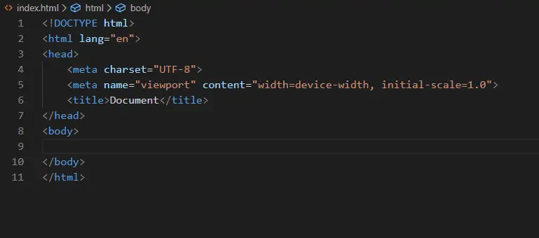

## 2.Auto Rename Tag

修改 html 标签，自动帮你完成尾部闭合标签的同步修改

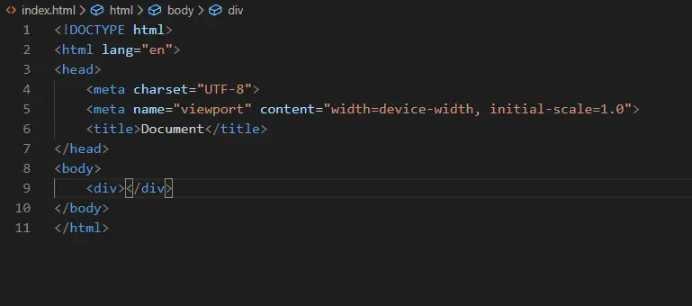

## 3.Path Intellisense

智能路径提示，可以在你输入文件路径时智能提示

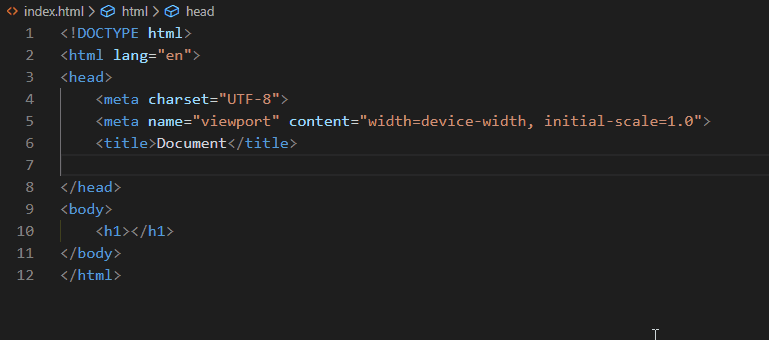

## 4.Open in Browser

这个插件能让你从 vscode 打开 html 文件，并且可以自由选择用哪个浏览器打开

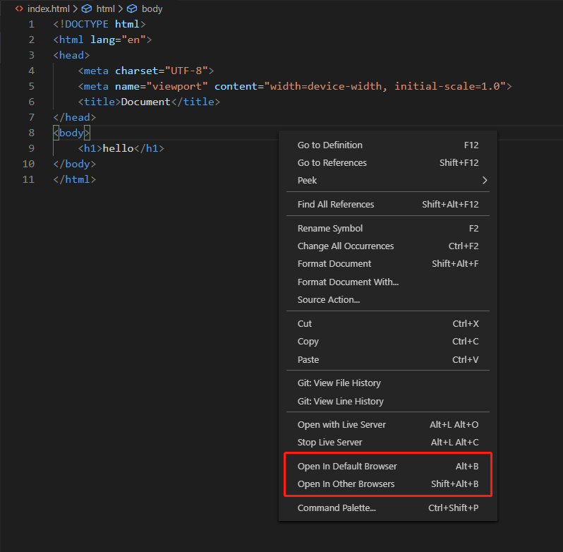

## 5.Live Server

在 vscode 中就可以直接启动一个本地服务，并且能监听文件变化自动刷新网页

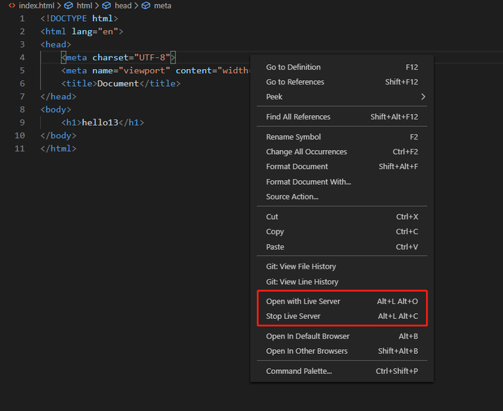

## 6.GitLens

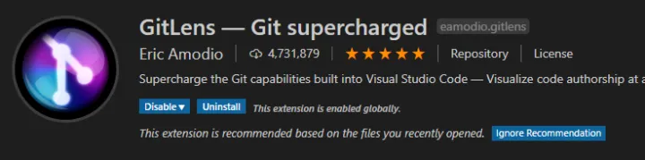

git 功能增强插件，鼠标放到代码行上，每一行代码的变动都一清二楚~

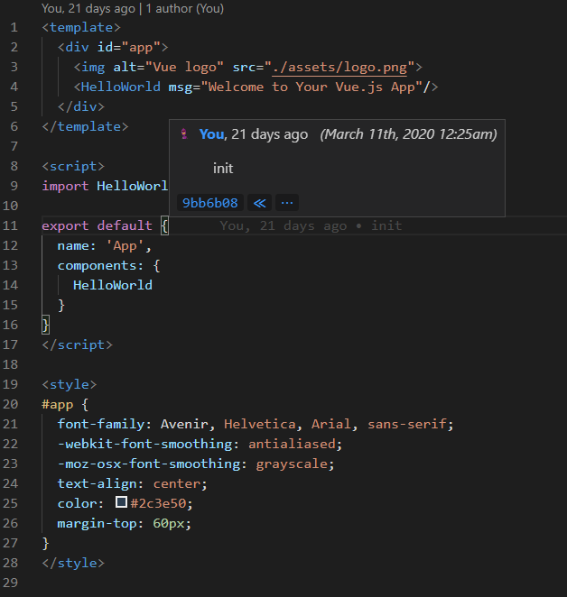

## 7.Vetur

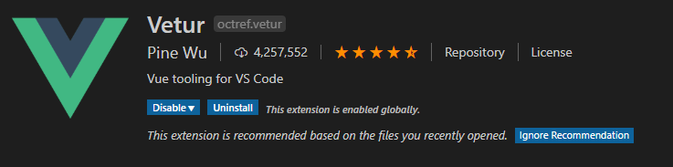

vue 开发必备插件，.vue 文件支持，语法高亮、智能提示

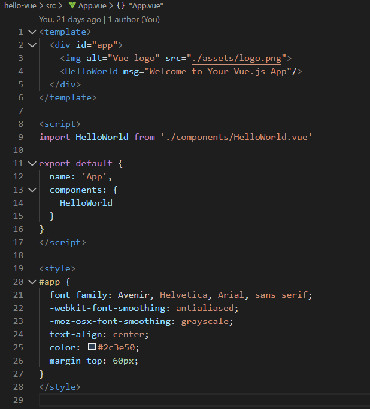

## 8.One Dark Pro

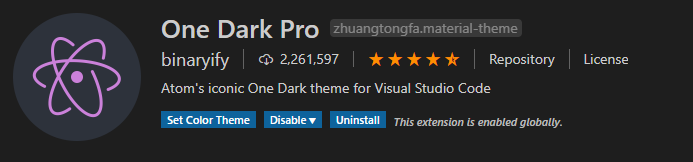

一款好看 vscode 的主题

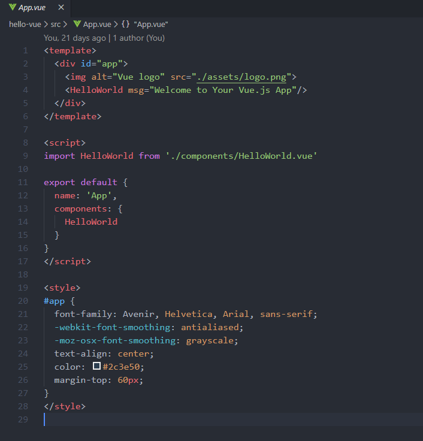

## 9. 中文插件

vscode全局中文插件

## 10. 安装教程

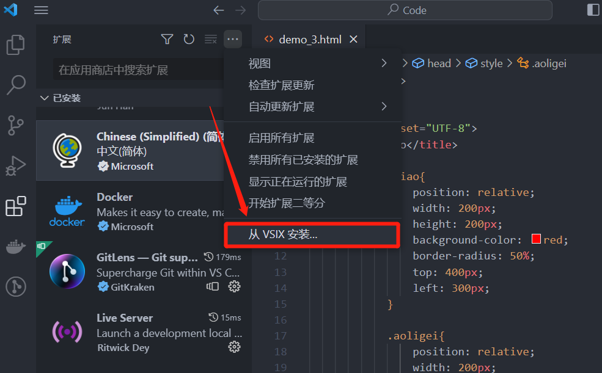

## [点击即可专挑百度网盘下载](https://pan.baidu.com/s/1PCzYxttV76G4qJHZ_6GvrQ?qwe=0326)

#### 提取码：0326

