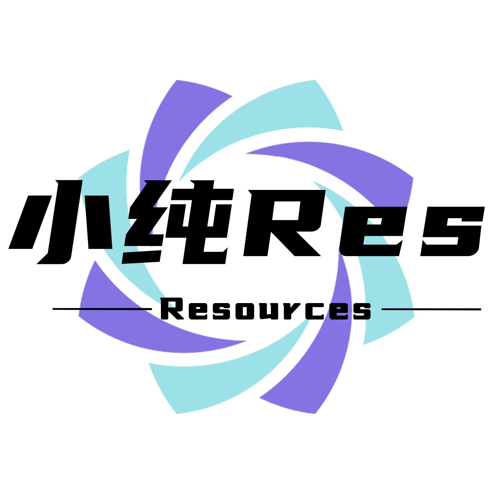

# 关于我

-------------

我自称梁小纯，来自中国充满历史底蕴的河南省。经历了15个春秋的沉淀，我不仅积累了岁月的智慧，更培养了对知识的渴望。在我丰富多彩的兴趣领域中，乒乓球与跆拳道成为我展现身体与意志的媒介，不仅考验着我的运动技巧，更是磨砺我意志坚定的特质。

然而，我的生命并不仅限于身体的活动，编程世界是我追求智慧与创造的舞台。沉浸于代码的海洋中，我探索着数学的奥秘，思考着逻辑的构建，激发出创新的火花。对编程的热爱源于对未知领域的探索渴望，我希望能够以代码书写出人类进步的乐章，用算法铸就未来的辉煌。

感谢您倾听我的简短自我介绍，期待在智慧的大道上，与您交流并共同前行。

